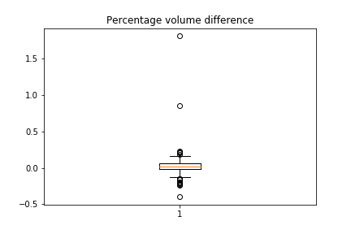

# Auckland_traffic
In this project we will analyse Auckland traffic data to estimate traffic volume change overtime without 
seasonal effects. In the end we will see that the data at hand does not allow us to draw a conclusion for 
the traffic volume change in Auckland. However, the method can still be useful once more data are collected.

For those who want to look at the data interactively, feel free to visit the app I built at
https://auckland-traffic-vis.herokuapp.com/. 

Note that it may take around 20 seconds to access the 
site (due to free tier hosting). Jupyter notebooks for the analysis are available at
[1_data_cleaning.ipynb](1_data_cleaning.ipynb) and [2_analysis.ipynb](2_analysis.ipynb).

## Data
Data was obtained from 
https://at.govt.nz/about-us/reports-publications/traffic-counts/. In particular we will
only analyze records that contains NZTM coordinate (which are later transfered into longitude 
and latitude in the analysis).

## Exploratory analysis
There are 2684 records with NZTM coordinates. The majority of the records we have are 
after 2018. We remove three records before December 2017 since these records have traffic count dates 
far apart from those of the other records. Only 219 coordinates (out of 2681) are sampled more than 
once and 29 coordinates are sampled more than twice since December 2017. 

Exploratory analysis shows very high correlation between all the traffic volume measures, e.g.
- `7 Day ADT` is highly correlated with `5 Day ADT` (ρ = 0.99808)
- `AM Peak Volume` is highly correlated with `Saturday Volume` (ρ = 0.92361)
- `Mid Peak Volume` is highly correlated with `AM Peak Volume` (ρ = 0.95097)
- `PM Peak Volume` is highly correlated with `Mid Peak Volume` (ρ = 0.97767)
- `Sunday Volume` is highly correlated with `Saturday Volume` (ρ = 0.98863)
- `Saturday Volume` is highly correlated with `7 Day ADT` (ρ = 0.98617) 

Therefore, for the following analysis we focus on one of the measures - `7 Day ADT`.
The statistics and the histogram graph of the measure are as the follows:
- count     2680.000000
- mean      9404.418657
- std       8412.181971
- min         13.000000
- 25%       2127.250000
- 50%       7334.500000
- 75%      14845.000000
- max      45272.000000

## Change of traffic volume over time
We will use the data from coordinates that are sampled more than once to estimate the change of traffic volume. 
First we look at the time periods between the first traffic count date and the last traffic count date.

We can see the maximum days apart between two traffic count dates is around 350 days, as 
represented by the cluster at the top-left cornor of the figure. These data points are good for measuring
the change of traffic volume since seasonality effects are minimal. 

We measure the volume change in percentage as . 

The calculated statistics and the boxplot are as follows:
- count    82.000000
- mean      0.038190
- std       0.244060
- min      -0.397260
- 25%      -0.014803
- 50%       0.015042
- 75%       0.065151
- max       1.810000

The median volume difference is 1.5%. The mean volume difference is 3.8% but there are quite a 
few outliers. It would be interesting to find out the reasons behind these outliers.

However, mapping the data shows that most records are not for Auckland but for areas
near Pukekohe, Waiuku and Manukau heads. So in the end we do not have a good estimation for the change 
of Auckland Traffic.

## Conclusion
In conclusion, we don't have the data that can tell us the change of traffic volume without seasonal 
effects. However, if we were to collect data 
1 year apart from the existing data at the coordinates of interest, we would be able to use the same 
analysis to estimate the change in traffic volume.

