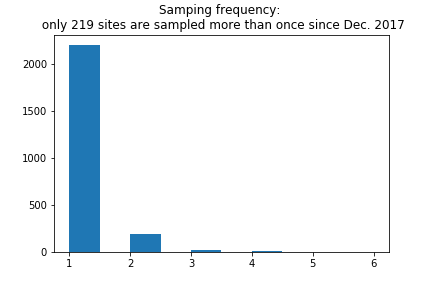
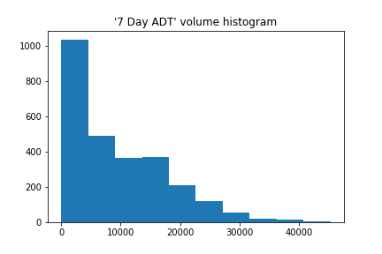
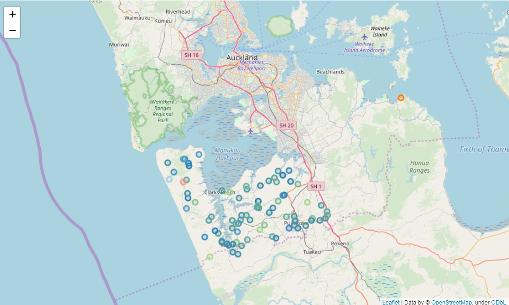

# Auckland_traffic
In this project, we analyse Auckland traffic data to estimate the change of traffic volume change over time. 

For those who want to look at the data interactively, feel free to visit the app I built at
https://auckland-traffic-vis.herokuapp.com/. 

Jupyter notebooks for the analysis are available at
[1_data_cleaning.ipynb](1_data_cleaning.ipynb) and [2_analysis.ipynb](2_analysis.ipynb).

## Data
Data was obtained from 
https://at.govt.nz/about-us/reports-publications/traffic-counts/ on 2019/07/02. I will
focus on records that contains NZTM coordinates (the coordinates are transformed into longitude 
and latitude in the analysis).

## Exploratory analysis
There are 2684 records with NZTM coordinates. The majority of the records are 
after 2018. We remove three records before December 2017 since these records have traffic count dates 
far apart from those of the other records. Only 219 coordinates (out of 2681) are sampled more than 
once and 29 coordinates are sampled more than twice since December 2017. 

Exploratory analysis shows very high correlation between all the traffic volume measures, e.g.
- `7 Day ADT` is highly correlated with `5 Day ADT` (ρ = 0.99808)
- `AM Peak Volume` is highly correlated with `Saturday Volume` (ρ = 0.92361)
- `Mid Peak Volume` is highly correlated with `AM Peak Volume` (ρ = 0.95097)
- `PM Peak Volume` is highly correlated with `Mid Peak Volume` (ρ = 0.97767)
- `Sunday Volume` is highly correlated with `Saturday Volume` (ρ = 0.98863)
- `Saturday Volume` is highly correlated with `7 Day ADT` (ρ = 0.98617) 

Therefore, for the following analysis we focus on one of the measures - `7 Day ADT`.
The statistics and the histogram graph of the measure are as the follows:
- count     2680.000000
- mean      9404.418657
- std       8412.181971
- min         13.000000
- 25%       2127.250000
- 50%       7334.500000
- 75%      14845.000000
- max      45272.000000

## Change of traffic volume over time
We use records in which the coordinates that are sampled more than once to estimate the change of traffic volume. 
The following figure shows the time periods between the first traffic count date and the last traffic count date.

We can see the maximum days apart between two traffic count dates is around 350 days, as 
represented by the cluster at the top-left cornor of the figure. These data points are good for measuring
the change of traffic volume since seasonality effects are minimal. 

We measure the volume change in percentage as . 

The statistics for percentage volume change and the boxplot are as follows:
- count    82.000000
- mean      0.038190
- std       0.244060
- min      -0.397260
- 25%      -0.014803
- 50%       0.015042
- 75%       0.065151
- max       1.810000

The median percentage volume difference is 1.5%. The mean volume difference is 3.8% but the mean value is skewed by the outliers. It would be interesting to look into the reasons behind these outliers.

Mapping of the data shows that most records are for the south of Auckland, near Pukekohe, Waiuku and Manaukau heads. 

## to be continued

