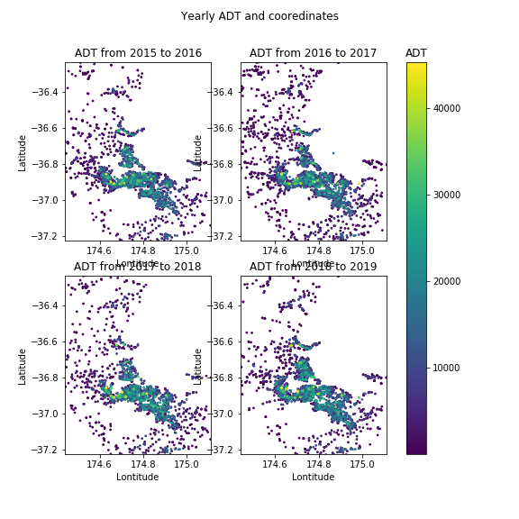

# Auckland_traffic
In this project, we analyse Auckland traffic data to estimate/forecast the change of traffic volume over time. 

For those who want to look at the data interactively, feel free to visit the app I built at
https://akl-traffic-vis.herokuapp.com/. 

## Data
Data was obtained from 
https://at.govt.nz/about-us/reports-publications/traffic-counts/ on 2019/07/02. 
There were two data files available. File `traffic-counts-to-march-2018-2019.csv` contains records from
2015-11-04 to 2019-04-09 and the data fields are explained on the website. File 
`traffic-counts-to-march-2018-2019.csv` contains data from 1958-10-01 to 2018-11-16, however the data fields
are different from the other file and were not explained. The two files are merged by a common traffic measure: `7-day average traffic count`(ADT) along with 
the coordinates and the road name. We transfer the coordinates from NZTM to latitudes and longitudes since they are easier to work with python mapping packages (e.g. folium for mapbox). 
Highway data were removed since the they are quite sparse while having a much higher traffic volume than the majority of road data. 
Details on data cleaning and merging can be found at [1_data_cleaning.ipynb](1_data_cleaning.ipynb). 

## Exploratory analysis
In this analysis we will focus oN (ADT). We consider ADT a good representative measure for the overall 
traffic measures since through initial exploratory analysis of file `traffic-counts-to-march-2018-2019.csv`, we found all other traffic measures are highly correlated with adt.

The merged data contains records from 1975 to 2019. By plotting the change of ADT over time, we 
can see gradual increase in traffic volume over time clearly. 

In particular, we notice that the sampling density is much higher after around 2010. 
The traffic volume reaches 
a peak around 2012, followed by a noticable decrease, both in the high percentile traffic volumes and in the number of traffic counts. 
The volume and the number of traffic counts then increase again and becomes more stable after 2015. 
We will focus on the records collected after 2010, since these records have similar sampling frequency and therefore are 
more comparible. The following figures presents a closer view at the data after 2010.

The following figure depicts the historical ADT and the coordinate index. The coordinate indices are sorted by 
increasing maximum ADT and the points are colored by days elapesd from 2010-01-01. 
We can see that the maximum ADT of a location is usually the most ADT record.

Plotting the scatter plot of date versus coordinate index discovers that the sampling pattern varying 
over time. For example, we can see there is dense sampling of the coordinates with top ADT around 
2011 and 2012 (circled in red) and rather sparse sampling at high ADT coordinates from mid 2012 
to early 2015 (circled in green).

Adding ADT as color scale shows that ADT over time for a coordinate appears to be stable. Note that there is 
a higher sampling density near central Auckland.

A closer look at records after 2015 and index larger than 12000 shows that there are indeed a few 
variations of ADT over time but systematical change in ADT is not observed.

The same conclusion is observed from the plot of ADT and coordinates. 

We also found certain locations are repeatly sampled and the variations between historical samples are 
reasonably consistant.

 

# Conclusion from exploratory analysis
Since both traffic count locations and traffic count frequencies vary over time, finding two 
comparible sample groups from the dataset to conduct statistical testing is difficult. 

An alternative approach to find insights from the dataset is to construct a model on top of the data and 
make inference from model outputs (which is currently in progress).

